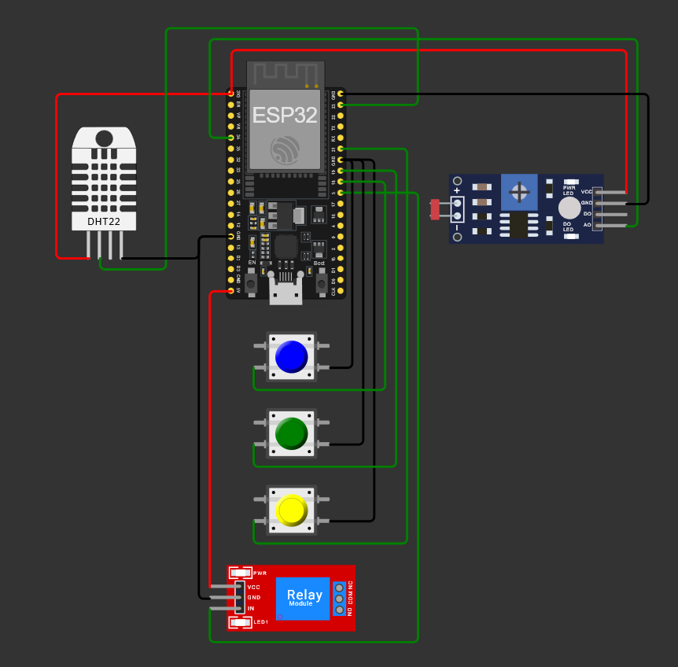

# FIAP - Faculdade de Informática e Administração Paulista

## Sistema de Irrigação Inteligente

## 👨‍🎓 Integrantes:
- Rafael Gomes de Macedo (RM566955)

## 👩‍🏫 Professores:

### Tutor(a):
- Sabrina Otoni
### Coordenador(a):
- André Godoi

## 🎯 Objetivo do Projeto
Desenvolver um **sistema de irrigação automatizado** utilizando o **ESP32** no ambiente **Wokwi**, simulando sensores agrícolas e uma bomba d’água controlada via relé.  
O sistema toma decisões com base na **umidade do solo**, **pH da terra (simulado via LDR)** e nos níveis de **Nitrogênio (N)**, **Fósforo (P)** e **Potássio (K)** simulados por pushbuttons.

---

## ⚙️ Componentes Utilizados
| Componente | Função | Pino do ESP32 |
|-------------|---------|---------------|
| DHT22 | Mede a umidade (solo) e temperatura | GPIO 23 |
| LDR (módulo) | Simula o pH da terra | GPIO 34 (entrada analógica) |
| Botão N | Simula presença de Nitrogênio | GPIO 18 |
| Botão P | Simula presença de Fósforo | GPIO 19 |
| Botão K | Simula presença de Potássio | GPIO 21 |
| Relé (1 canal) | Aciona a bomba d’água | GPIO 5 |

💡 *Todos os GNDs estão interligados e o relé é ativo em LOW.*

---

## 🔌 Circuito no Wokwi
Imagem do circuito completo com todas as conexões:

 

🔗 **Link do projeto:** [Acessar no Wokwi](./wokwi/link_projeto.txt)

---

## 💻 Código do ESP32
O código fonte está disponível em [`esp32/irrigacao_farmtech.ino`](esp32/projeto.ino).

Ele foi desenvolvido em **C/C++** com a biblioteca **DHT.h**, utilizando lógica de decisão e histerese:

### 🔍 Lógica de irrigação:
1. Lê sensores:
   - Umidade do solo (DHT22)
   - pH (LDR mapeado 0–14)
   - Botões N, P, K (níveis de nutrientes)
2. Calcula regras:
   - Umidade < 45% → **Liga bomba**
   - Umidade ≥ 55% → **Desliga bomba**
   - pH entre 6.0 e 6.8 → **OK**
   - NPK todos “OK” → **OK**
   - Chuva prevista (`Rain: YES`) → **Força bomba OFF**
3. Exibe leituras no Serial Monitor:

Umid(%): 27.5 Temp(C): 33.3 LDR: 1880 pH: 6.43
N: OK P: OK K: OK pHwin: OK NPKrule: OK Rain: NO PUMP: ON

---

## 🌦️ Comandos no Serial Monitor
| Comando | Função |
|----------|---------|
| `R` | Simula chuva prevista (desativa irrigação por 30 minutos) |
| `C` | Cancela chuva prevista (reativa irrigação) |

---

## 🧪 Testes Realizados

| Cenário | Condição | Resultado Esperado |
|----------|-----------|--------------------|
| Umidade < 45%, pH OK, NPK OK, sem chuva | Todas as condições atendidas | **Bomba liga (`PUMP: ON`)** |
| Umidade ≥ 55% | Umidade alta | **Bomba desliga (`PUMP: OFF`)** |
| pH fora da faixa (ex: > 7) | Terra alcalina | **Bomba desliga (`pHwin: OUT`)** |
| NPK incompleto (ex: P solto) | Falta nutriente | **Bomba desliga (`NPKrule: NO`)** |
| Chuva prevista (`R`) | Previsão de chuva | **Bomba desliga (`Rain: YES`)** |
| Cancela chuva (`C`) | Fim da chuva | **Bomba volta a operar normalmente** |

---

## 🧠 Funcionamento Geral

O sistema funciona como um **mini modelo de agricultura de precisão**, aplicando conceitos de:
- **IoT (Internet das Coisas)** para coleta e controle;
- **Lógica de decisão embarcada** no microcontrolador;
- **Otimização de recursos** (água e insumos agrícolas).

---

## 📹 Demonstração em Vídeo
🎥 [Link do vídeo de demonstração no YouTube](https://youtube.com/) *(coloque aqui o link do seu vídeo não listado)*
